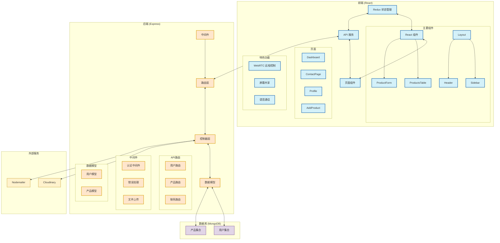

```mermaid
graph TB
    subgraph "前端 (React)"
        A[Redux 状态管理] <--> B[React 组件]
        B <--> C[页面组件]
        A <--> D[API 服务]
        D <--> C
        
        subgraph "主要组件"
            B1[Layout] --> B2[Sidebar]
            B1 --> B3[Header]
            B --> B4[ProductsTable]
            B --> B5[ProductForm]
        end
        
        subgraph "页面"
            C1[Dashboard] 
            C2[ContactPage]
            C3[Profile]
            C4[AddProduct]
        end
        
        subgraph "特色功能"
            E1[WebRTC 远程控制]
            E2[屏幕共享]
            E3[语音通话]
        end
    end
    
    subgraph "后端 (Express)"
        F[路由层] <--> G[控制器层]
        G <--> H[数据模型]
        I[中间件] --> F
        
        subgraph "API路由"
            F1[用户路由]
            F2[产品路由]
            F3[联系路由]
        end
        
        subgraph "中间件"
            I1[认证中间件]
            I2[错误处理]
            I3[文件上传]
        end
        
        subgraph "数据模型"
            H1[用户模型]
            H2[产品模型]
        end
    end
    
    subgraph "数据库 (MongoDB)"
        J[用户集合]
        K[产品集合]
    end
    
    subgraph "外部服务"
        L1[Cloudinary]
        L2[Nodemailer]
    end
    
    %% 连接关系
    D <--> F
    H <--> J
    H <--> K
    G <--> L1
    G <--> L2
    
    %% 样式
    classDef frontend fill:#d4f1f9,stroke:#05a,stroke-width:2px
    classDef backend fill:#ffe6cc,stroke:#d79b00,stroke-width:2px
    classDef database fill:#e1d5e7,stroke:#9673a6,stroke-width:2px
    classDef external fill:#fff2cc,stroke:#d6b656,stroke-width:2px
    
    class A,B,C,D,B1,B2,B3,B4,B5,C1,C2,C3,C4,E1,E2,E3 frontend
    class F,G,H,I,F1,F2,F3,I1,I2,I3,H1,H2 backend
    class J,K database
    class L1,L2 external
```